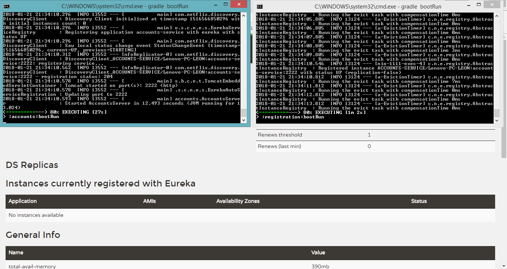
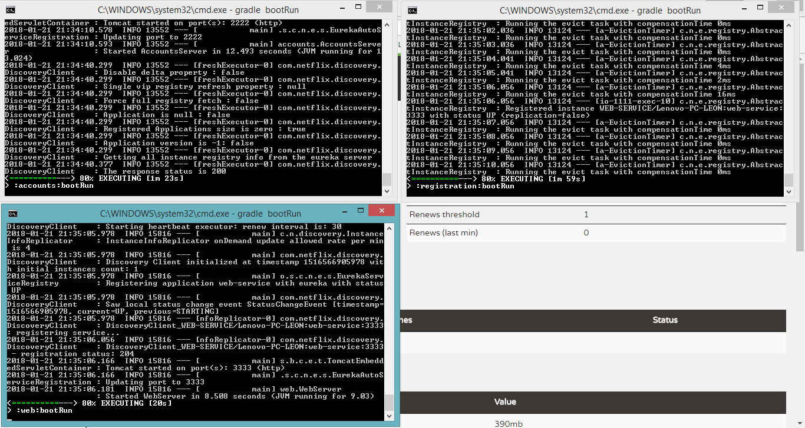
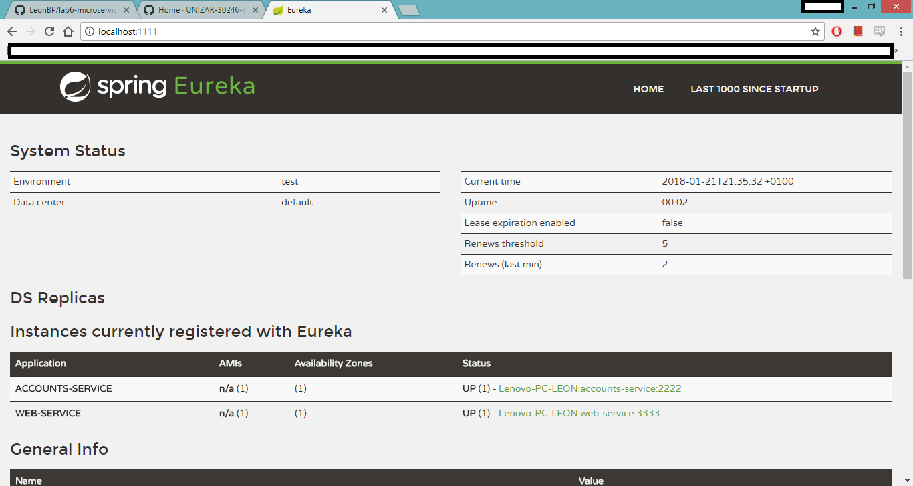
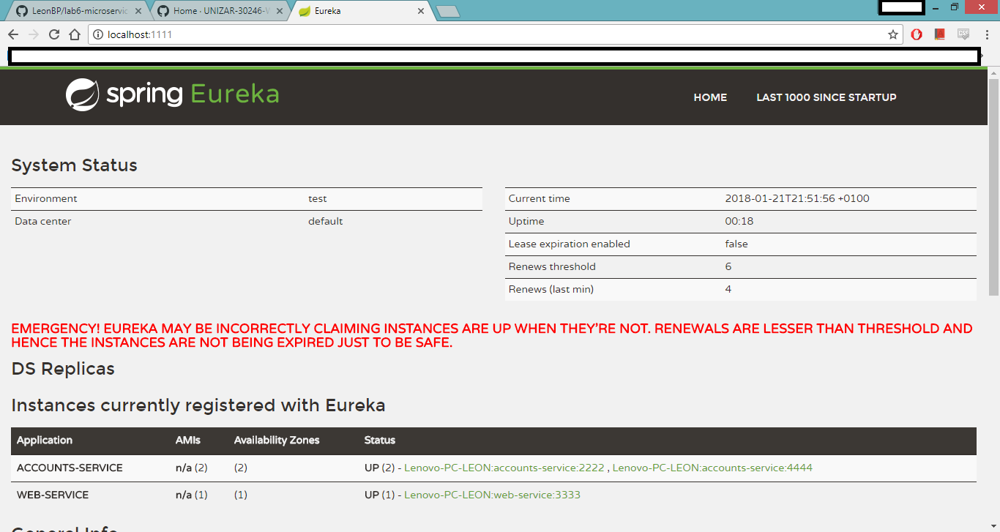
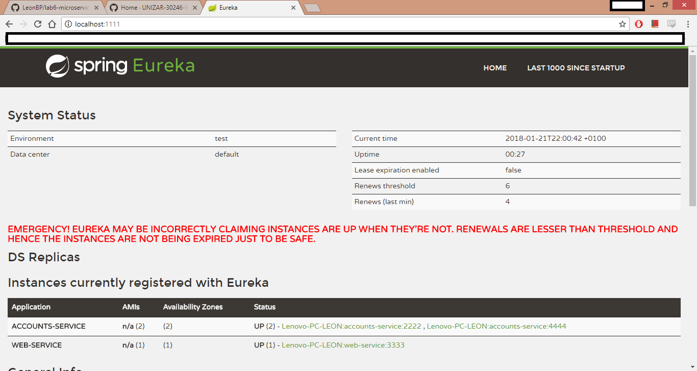

# Web Engineering 2017-2018 / Microservices

##  Two microservices running and registered
First, the two microservices are started:

Note: The first microservice is the top-left terminal, and the second is the bottom-left.

When both microservices are running, we can check they are registered by consulting the dashboard:

##  A second account microservice in the port 4444
This second account microservice is executed in a forth terminal (bottom-right).

We can check the effect of the above process by consulting again the dashboard:

## Microservice in port 2222 is killed
First, we stop the microservice:

We check if there has been any change in the dashboard:

The service has detected that there is a problem with one of the servers. The web service can provide information about the accounts because there is at least one account microservice running (the one in the port 4444). The service can be provided because Eureka works as a load balancer. This means that the web service sends requests to the account service (in this case in the port 2222), but the communication fails because that server is down. Then, Eureka tries with the other account server (4444) and it responds successfully. This results in some request failed but eventually the service is provided.
